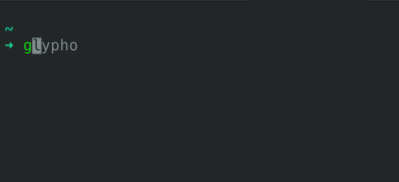

# Glypho 


**Glypho** is a fast, minimal CLI tool written in Rust to render Markdown files in a clean, pretty format via a local web server.

- View your Markdown files in a beautiful format
- Fast startup and live preview through a local web server

## Why Glypho?

Glypho was created to make reading Markdown as frictionless as possible — especially when you just want to **open a file and read**. No need to open a full editor or configure plugins. Just run the command and go.

> no heavy dependencies — just Markdown and Rust.

## Installation

Glypho runs on Linux, macOS, and Windows.

### Prebuilt binaries

Download the archive for your platform from the [GitHub releases](https://github.com/trafkin/glypho/releases) page:

- Linux: `glypho-x86_64-unknown-linux-musl.tar.gz` (static, runs anywhere) or the `.deb` package
- macOS: `glypho-aarch64-apple-darwin.tar.gz`
- Windows: `glypho-x86_64-pc-windows-msvc.zip`

On Debian/Ubuntu you can install the `.deb` directly:

```sh
sudo apt install ./glypho_<version>_amd64.deb
```

### From crates.io

Requires [Node.js](https://nodejs.org/) (npm on PATH) — the build script bundles the frontend.

```sh
cargo install glypho
```

### From source

1. Pull the repository and go to the root directory
2. Run `cargo install --path .`

### With Nix (Linux and macOS)

```sh
nix run github:trafkin/glypho -- <file.md>
```

Or enter the dev shell for hacking on the project:

```sh
nix develop
```

## Usage


